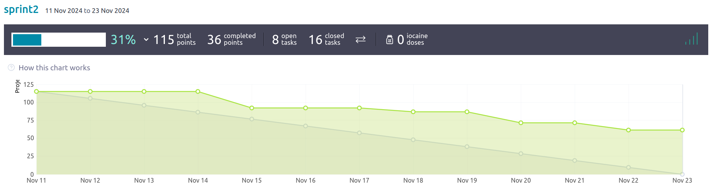
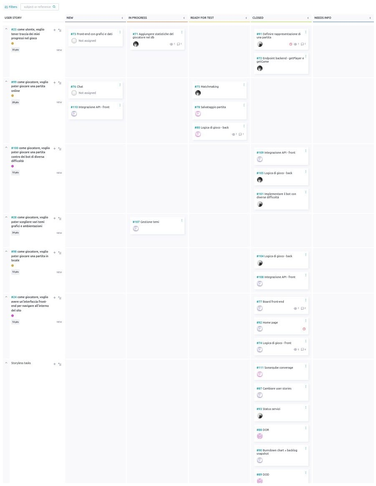
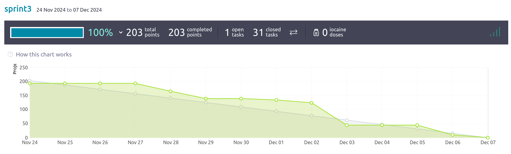
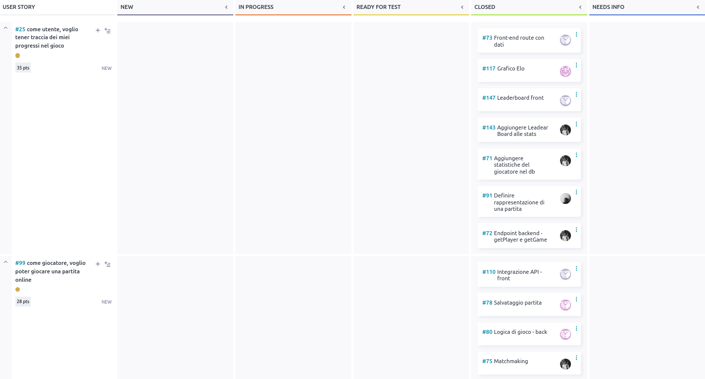
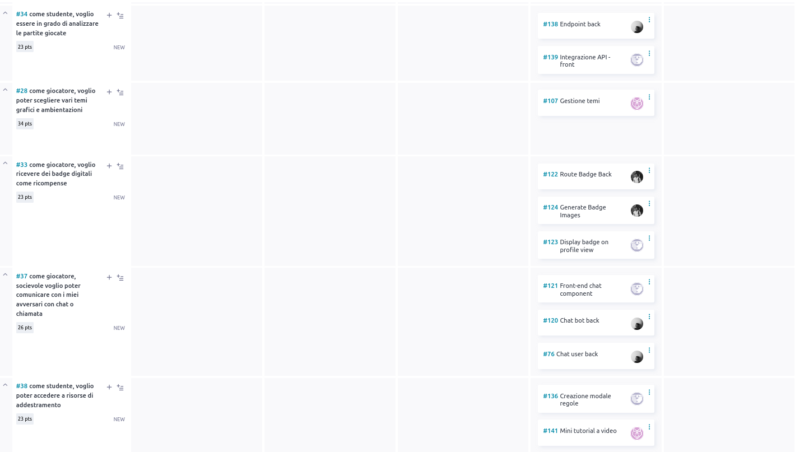
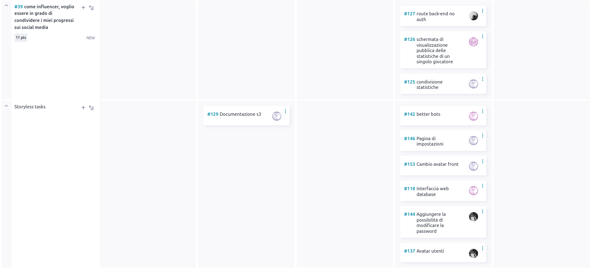

# Backlog grooming
## Sprint 1

#### Completato
- creazione account
- demo partita tra due giocatori in locale

#### Debito tecnico
- gestione partita back-end
- chat partita
- statistiche account
- matchmaking

## Sprint 2

#### Completato
- partita locale con validazione mosse
- partita contro CPU (easy, medium, hard)
- interfaccia front-end con tema di default retrò

#### Debito tecnico
- partita online
- temi alternativi
- chat partita
- matchmaking
- statistiche account

## Sprint 3

#### Completato
- progressi e statistiche
- partita online
- analizzare le partite giocate
- temi alternativi
- badge digitali
- chat partita
- risorse di addestramento (breve tutorial)
- condivisione dei progressi sui sociaò

#### Debito tecnico
Nulla