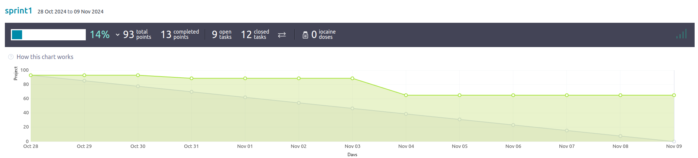
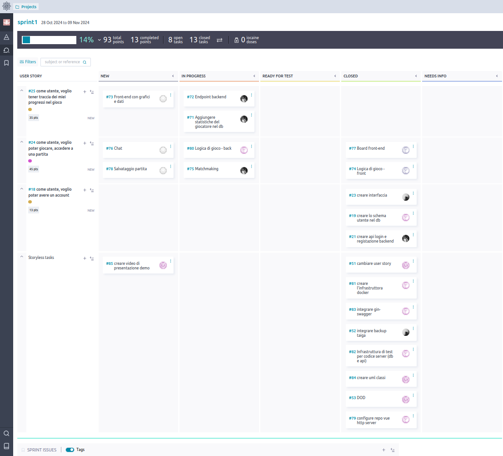

# Backlog grooming
## Sprint 1

#### Completato
- creazione account
- demo partita tra due giocatori in locale

#### Debito tecnico
- gestione partita back-end
- chat partita
- statistiche account
- matchmaking

### Riflessione finale
Durante questo sprint, il carico di lavoro front-end è stato significativamente inferiore rispetto a quello back-end, 
causando tempi di inattività per i sviluppatori front-end in attesa del completamento delle componenti server.
Per ottimizzare gli sprint futuri, sarà fondamentale:

- Bilanciare meglio la distribuzione delle attività tra front-end e back-end
- Garantire un flusso di sviluppo continuo e efficiente

Il sovraccarico di user stories assegnate a questo sprint ha generato un debito tecnico considerevole che dovrà essere gestito 
nello sprint successivo. Di conseguenza, le attività inizialmente pianificate dovranno essere riprogrammate.
Product Owner e Scrum Master si incontreranno lunedì per valutare strategie che evitino l'aggiunta di uno sprint 
supplementare rispetto alla pianificazione iniziale. 
Qualora l'estensione risultasse inevitabile, si procederà con una nuova distribuzione delle user stories.

## Sprint 2
