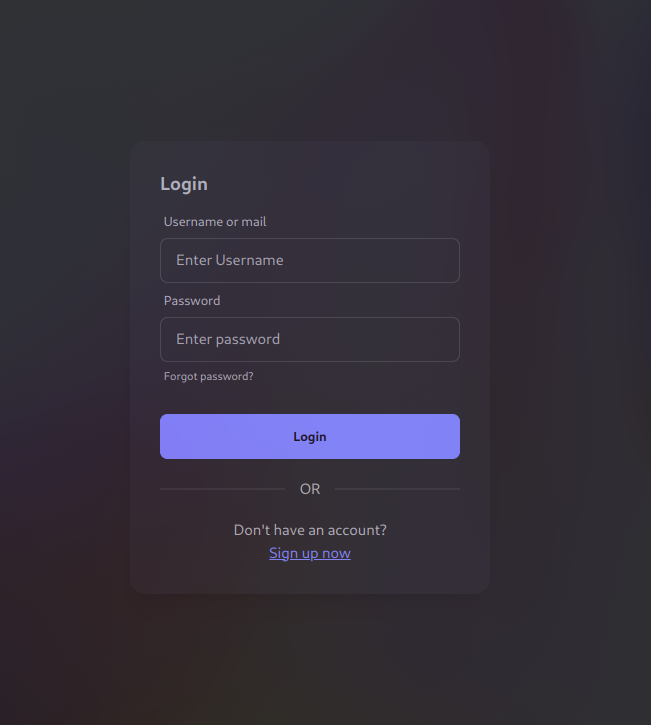

# Sprint review
## Sprint 1
### Game view

### Login screen

### Completato
Alla fine del primo sprint, il team ha completato con successo le seguenti user stories:
- #18 creazione account

Tra le User Stories inizialmente pianificate, la creazione dell'account è stata la più semplice da implementare. Si e' rilevato un ritardo nella demo della partita tra due giocatori in online, a causa di problemi con le teconlogie utilizzate. Il front-end ha completato la demo in locale, ma il back-end non è riuscito a completare la demo online.

### Debito tecnico
- #25 dashboard progressi nel gioco
- #24 partita online tra due giocatori o tra un giocatore e un bot

Il team ha accumulato un debito tecnico significativo durante lo sprint. La gestione della partita online e la dashboard dei progressi nel gioco sono state le user stories più complesse da implementare. Il team ha deciso di posticipare queste attività allo sprint successivo.

### Problematiche riscontrate
I problemi principali rilevati dal team in questo sprint che hanno rallentato il progresso sono stati:
- l'utilizzo di nuove tecnologie che non tutti conoscevano bene, sia i software richiesti dal progetto (Jenkins, Sonarqube, Taiga) sia i linguaggi usati (Go, Vue, SQL)
- la scelta della rappresentazione di una partita lato server, che doveva adattarsi alla rappresentazione utilizzata dall'analizzatore di mosse che volevamo usare per permettere all'utente di giocare contro la CPU.

Entrambi le problematiche dovrebbero essere superate, poichè il team ha acquisito familiarità con i nuovi software e l'architettura di gioco sta venendo ultimata; si prevede che per il prossimo sprint non causeranno ulteriore ritardo.

## Sprint 2
