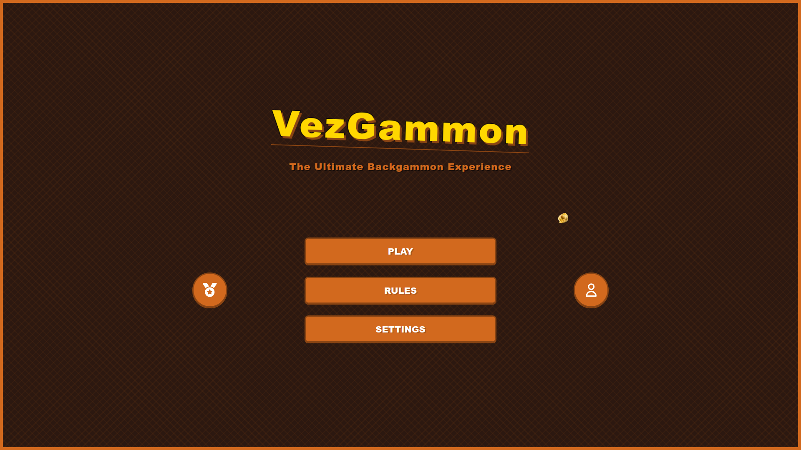

# Sprint review
## Sprint 1
### Game view

### Login screen

### Completato
Alla fine del primo sprint, il team ha completato con successo le seguenti user stories:
- #18 creazione account

Tra le User Stories inizialmente pianificate, la creazione dell'account è stata la più semplice da implementare. Si e' rilevato un ritardo nella demo della partita tra due giocatori online, a causa di problemi con le teconlogie utilizzate. Il front-end ha completato la demo in locale, ma il back-end non è riuscito a completare la demo online.

### Debito tecnico
- #25 dashboard progressi nel gioco
- #24 partita online tra due giocatori o tra un giocatore e un bot

Il team ha accumulato un debito tecnico significativo durante lo sprint. La gestione della partita online e la dashboard dei progressi nel gioco sono state le user stories più complesse da implementare. Il team ha deciso di posticipare queste attività allo sprint successivo.

### Problematiche riscontrate
I problemi principali rilevati dal team in questo sprint che hanno rallentato il progresso sono stati:
- l'utilizzo di nuove tecnologie che non tutti conoscevano bene, sia i software richiesti dal progetto (Jenkins, Sonarqube, Taiga) sia i linguaggi usati (Go, Vue, SQL)
- la scelta della rappresentazione di una partita lato server, che doveva adattarsi alla rappresentazione utilizzata dall'analizzatore di mosse che volevamo usare per permettere all'utente di giocare contro la CPU.

Entrambi le problematiche dovrebbero essere superate, poichè il team ha acquisito familiarità con i nuovi software e l'architettura di gioco sta venendo ultimata; si prevede che per il prossimo sprint non causeranno ulteriore ritardo.

## Sprint 2
### Home screen

### Game modes

### Board

### Completato
Alla fine del secondo sprint, il team ha completato con successo le seguenti user stories:
- #24: come giocatore, voglio avere un'interfaccia front-end per navigare all'interno del sito
- #98: come giocatore, voglio poter giocare una partita in locale
- #100: come giocatore, voglio poter giocare una partita contro dei bot di diversa difficoltà

C'è stata una maggior coesione frontend - backend che ha permesso di completare sia l'interfaccia che la parte server del gioco in locale e contro la CPU.
La partita in locale è stata la prima a essere completata ed è stata testata per più tempo, permettendo ai developers di correggere bug vari che si sono presentati.
Invece, la sezione relativa al bot è stata conclusa a ridosso della fine dello sprint; gli unit test sono passati ma non sono state giocate sufficienti partite per 
garantire la totale assenza di problemi; questa attività verrà svolta nello sprint successivo.

### Debito tecnico
- #99: come giocatore, voglio poter giocare una partita online (implementare chat di gioco e testare matchmaking)
- #23: come utente, voglio tener traccia dei miei progressi di gioco
- #28: come giocatore, voglio poter scegliere vari temi grafici e ambientazioni

Breve commento

### Problematiche riscontrate

TODO diebbo
- molto tempo speso per l'infrastruttura, che però funziona perfettamente
- volendo si può parlare di status.vezgammon.it
- troppe us nel backlog, viste le scadenze non sarà possibile realizzarne molte 
   (backlog visto come "se fosse un vero progetto da mantenere nel tempo, queste sono le features che potremmo sviluppare")
- difficoltà ad integrare il progetto con api del bot (vedi problematiche dello sprint precedente), alla fine risolta definitivamente ma con molto sforzo
