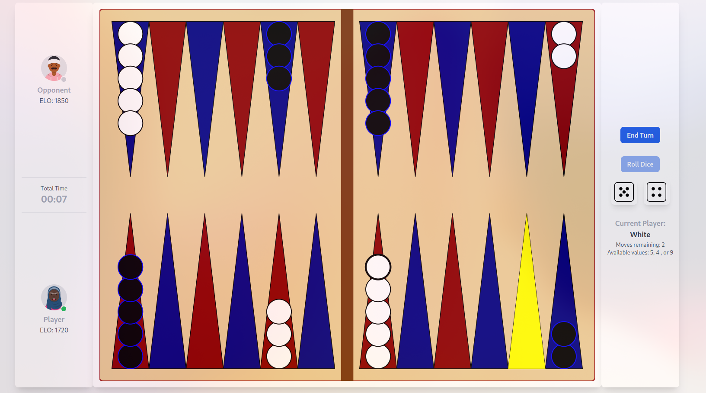
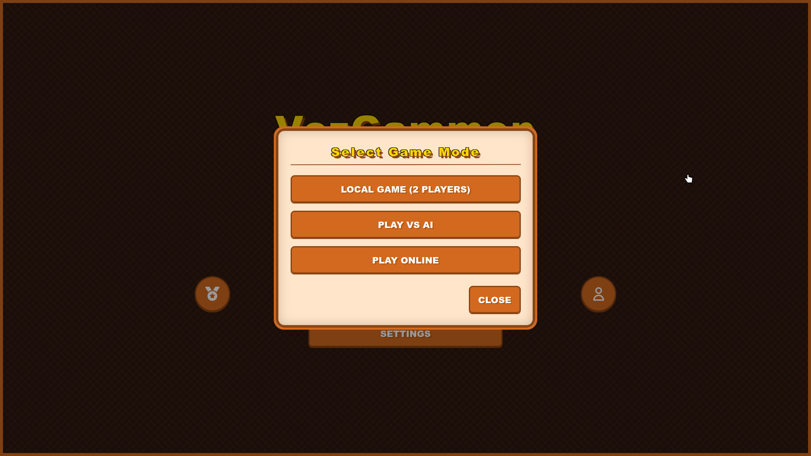
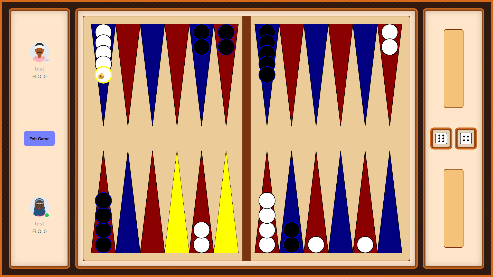
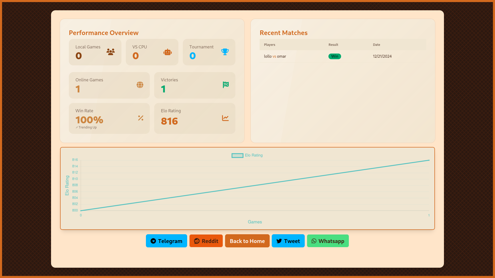
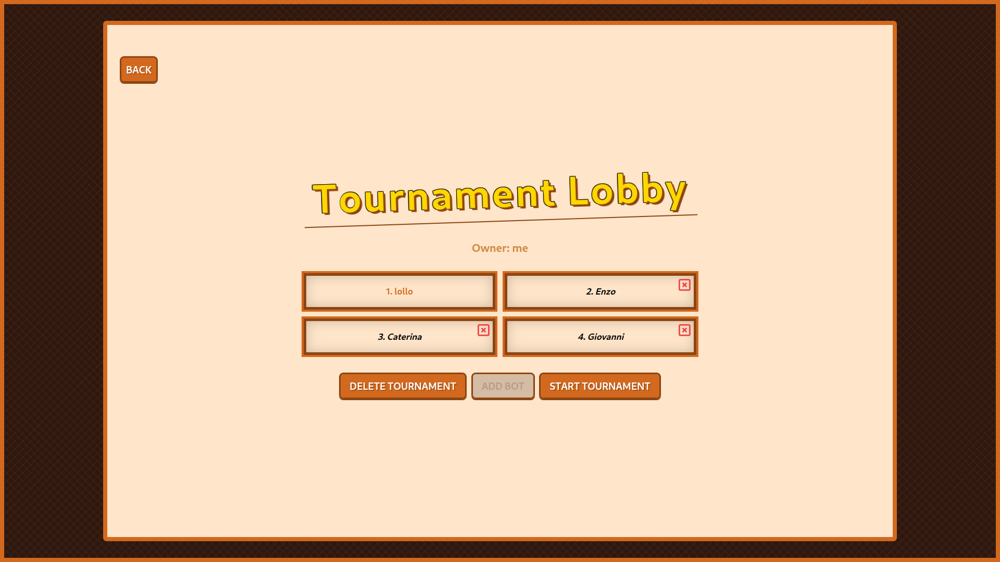
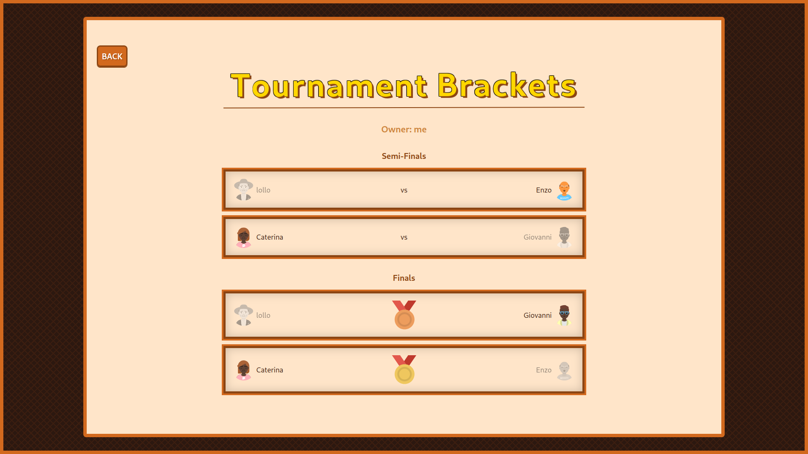
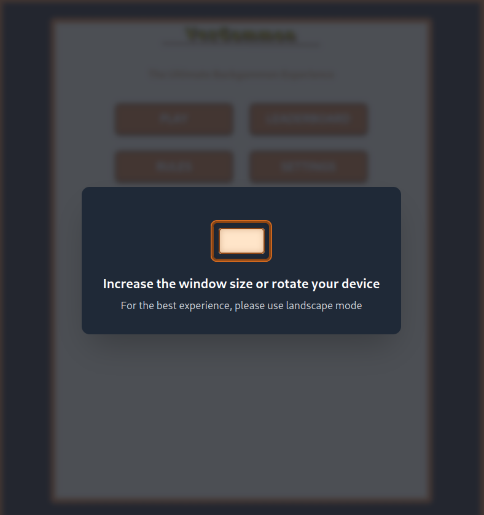

# Sprint review
## Sprint 1
### Game view

### Login screen

### Completato
Alla fine del primo sprint, il team ha completato con successo le seguenti user stories:
- #18 creazione account

Tra le User Stories inizialmente pianificate, la creazione dell'account è stata la più semplice da implementare. Si e' rilevato un ritardo nella demo della partita tra due giocatori online, a causa di problemi con le teconlogie utilizzate. Il front-end ha completato la demo in locale, ma il back-end non è riuscito a completare la demo online.

### Debito tecnico
- #25 dashboard progressi nel gioco
- #24 partita online tra due giocatori o tra un giocatore e un bot

Il team ha accumulato un debito tecnico significativo durante lo sprint. La gestione della partita online e la dashboard dei progressi nel gioco sono state le user stories più complesse da implementare. Il team ha deciso di posticipare queste attività allo sprint successivo.

### Problematiche riscontrate
I problemi principali rilevati dal team in questo sprint che hanno rallentato il progresso sono stati:
- l'utilizzo di nuove tecnologie che non tutti conoscevano bene, sia i software richiesti dal progetto (Jenkins, Sonarqube, Taiga) sia i linguaggi usati (Go, Vue, SQL)
- la scelta della rappresentazione di una partita lato server, che doveva adattarsi alla rappresentazione utilizzata dall'analizzatore di mosse che volevamo usare per permettere all'utente di giocare contro la CPU.

Entrambi le problematiche dovrebbero essere superate, poichè il team ha acquisito familiarità con i nuovi software e l'architettura di gioco sta venendo ultimata; si prevede che per il prossimo sprint non causeranno ulteriore ritardo.

## Sprint 2
### Home screen

### Game modes

### Board

### Completato
Alla fine del secondo sprint, il team ha completato con successo le seguenti user stories:
- #24: come giocatore, voglio avere un'interfaccia front-end per navigare all'interno del sito
- #98: come giocatore, voglio poter giocare una partita in locale
- #100: come giocatore, voglio poter giocare una partita contro dei bot di diversa difficoltà

C'è stata una maggior coesione frontend - backend che ha permesso di completare sia l'interfaccia che la parte server del gioco in locale e contro la CPU.
La partita in locale è stata la prima a essere completata ed è stata testata per più tempo, permettendo ai developers di correggere bug vari che si sono presentati.
Invece, la sezione relativa al bot è stata conclusa a ridosso della fine dello sprint; gli unit test sono passati ma non sono state giocate sufficienti partite per 
garantire la totale assenza di problemi; questa attività verrà svolta nello sprint successivo.

### Debito tecnico
- #99: come giocatore, voglio poter giocare una partita online (implementare chat di gioco e testare matchmaking)
- #23: come utente, voglio tener traccia dei miei progressi di gioco
- #28: come giocatore, voglio poter scegliere vari temi grafici e ambientazioni

Il team ha accumulato un debito tecnico significativo durante lo sprint. La gestione della partita online e la dashboard dei progressi nel gioco sono state le user stories più complesse da implementare. Il team ha deciso di posticipare queste attività allo sprint successivo.

### Problematiche riscontrate

La sfida principale di questo sprint è stata l'integrazione del progetto con le API del bot. Il team front-end ha inizialmente implementato una versione semplificata del bot per completare la user story #100, ma questa soluzione temporanea ha richiesto successivamente un significativo refactoring per l'integrazione con il back-end. L'implementazione della soluzione definitiva, sebbene più impegnativa in termini di tempo e risorse, si è resa necessaria verso la fine dello sprint.
Gli investimenti effettuati durante il primo sprint per la creazione di un'infrastruttura solida si sono rivelati preziosi, accelerando lo sviluppo del progetto grazie a un ambiente stabile e ben configurato. L'implementazione del sistema CI/CD ha automatizzato con successo i processi di deploy e test. Inoltre, la configurazione di un [servizio](status.vezgammon.it) di monitoraggio ha permesso di osservare in tempo reale le statistiche dei container in esecuzione, facilitando la rapida risoluzione di eventuali problemi di accessibilità.
Si è inoltre evidenziato un accumulo significativo di user stories nel backlog, che difficilmente potranno essere completate entro la conclusione del progetto. Queste sono state pertanto classificate come potenziali sviluppi futuri, nell'eventualità di una continuazione del progetto.

## Sprint 3
### Leaderboard

### Profile & badges

### Rules

### Stats

### Completato
- #25: come utente, voglio tener traccia dei miei progressi nel gioco
- #99: come giocatore, voglio poter giocare una partita online
- #34: come studente, voglio essere in grado di analizzare le partite giocate
- #28: come giocatore, voglio poter scegliere vari temi grafici e ambientazioni
- #33: come giocatore, voglio ricevere dei badge digitali come ricompense
- #37: come giocatore, socievole voglio poter comunicare con i miei avversari con chat o chiamata
- #38: come studente, voglio poter accedere a risorse di addestramento
- #39: come influencer, voglio essere in grado di condividere i miei progressi sui social media

### Debito Tecnico

Nulla

### Problematiche riscontrate

Durante questo sprint è stato effettuato un importante refactor della board, che inizialmente contava oltre 1.000 linee di codice. La suddivisione in più componenti ha permesso di eliminare una delle principali cause del debito tecnico accumulato, migliorando significativamente la leggibilità e la manutenibilità del codice.

Nonostante una lieve sovrastima del carico di lavoro che si pensava di poter completare, il grafico di Taiga è rimasto coerente e ben strutturato, dimostrando un'adeguata pianificazione complessiva. Tutto ciò che era stato pianificato è stato comunque completato con successo, grazie a un team ben coordinato e a una comunicazione costante e produttiva.

Di comune accordo, il team ha deciso di aggiungere un ultimo sprint. Questo sarà dedicato al completamento delle poche feature ancora presenti nel backlog, nonché a un lavoro intenso di refactor e test. L’obiettivo è garantire che il prodotto finale sia solido, ottimizzato e pronto per l’uso con standard qualitativi elevati.

## Sprint 4
### Tournaments

### Popup responsiveness

### Completato

- #26: come creatore di tornei, voglio essere in grado di creare, amministrare tornei
- #164: come utente, vorrei poter usare il sito anche da cellulare
- #40: come utente, voglio ricevere le notifiche dal sito

### Debito Tecnico

Nulla

### Problematiche riscontrate

Fine della gestione dei tornei backend. Si sono riscontrati parecchi problemi con il sistema delle statistiche, che sono stati man mano risolti, 
ma che hanno portato un rallentamento nello sviluppo.

Quest'ultimo sprint si e' rivelato utile per poter portare a termine le ultime task rimaste e sistemare e riorganizzare al meglio il codice preesistenre. 
Il team ha lavorato con maggiore coordinazione e ha potuto completare il progetto con successo.
